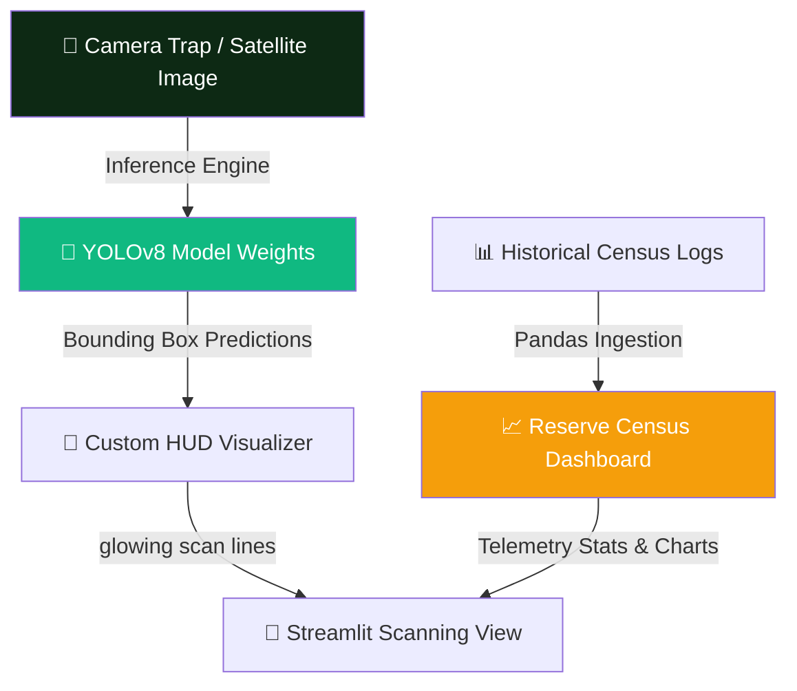

<div align="center">

# 🌿 Safari Sight AI — Autonomous Jungle Scanner & Census Dashboard

### 🌐 **[Scan the Reserve & Track Wild Populations](https://faunafind-project.streamlit.app/)**

[](https://git.io/typing-svg)


<br/>

### **Deep Learning meets Wildlife Conservation.**  
### **Real-time object detection and density tracking across protected reserves.** 🦒

</div>

---

## ⚡ **THE SCANNING ENGINE AT A GLANCE**

### 🎯 **What Safari Sight AI Does**
Safari Sight AI is a **jungle-themed computer vision application** designed to detect and log key species in African wildlife reserves. Utilizing a custom-trained **YOLOv8 Object Detection Model**, it parses camera trap snapshots and satellite feeds to instantly localize, count, and log animals. The results feed directly into a historical **Census Analytics Dashboard** to identify population trends and species distribution.

**Core Pipeline Pillars:**
* 🎯 **YOLOv8 Edge Inference** → Fast, accurate identification of wild Buffaloes, Elephants, Rhinos, and Zebras.
* 🌿 **Jungle HUD UI** → Translucent dark-mode styling featuring falling leaves animations, holographic scanner grids, and laser scanning overlays.
* 📊 **Census Dashboard** → Interactive visualizations of historic camera trap detections mapping species densities.
* 📥 **Expedition Reports** → Instant telemetry exports, allowing field researchers to download CSV data of live scans.

### 🦁 **Species Registry Grid**

| Species | Primary Habitat | Distinguishing Features | Scientific Family | Icon |
| :--- | :--- | :--- | :---: | :---: |
| **African Buffalo** | Savannah & Woodlands | Large curved horns, robust build, dark skin. | *Bovinae* | 🐃 |
| **African Elephant** | Forests & Grasslands | Large ears, long tusks, trunk-based intelligence. | *Elephantidae* | 🐘 |
| **White/Black Rhino** | Grasslands & Scrublands | Prehensile lip, dual keratin horns, armored skin. | *Rhinocerotidae* | 🦏 |
| **Plains Zebra** | Open Plains | Distinctive black & white stripes, herd mobility. | *Equidae* | 🦓 |

---

## 🛠️ **TECHNOLOGY & ARCHITECTURE STACK**

<div align="center">


</div>

| **Category** | **Technologies** | **Role & Implementation** |
|:------------:|:-----------------|:--------------------------|
| 🐍 **Core Logic** | Python 3.9+ / OpenCV | Handles image ingestion, array operations, and bounding-box drawing. |
| 🧠 **Inference Model**| Ultralytics YOLOv8 | Runs neural network weights (`best.pt`) for real-time bounding-box predictions. |
| 📊 **Analytics** | Pandas & Streamlit | Aggregates daily telemetry reports and prints interactive dashboard metrics. |
| 🎨 **HUD UI** | Custom CSS & HTML | Implements falling leaves background physics, HUD scan lines, and organic borders. |

---

## 🔬 **SYSTEM ARCHITECTURE FLOW**



### **Technical Breakdown:**

#### 1. Custom-Trained YOLOv8 Architecture 🧠
The model is fine-tuned to classify 4 primary classes under the COCO-compatible format. During inference, images are scaled and normalized before passing through the Backbone and Neck layers, yielding coordinates:
```text
Box = [x_min, y_min, x_max, y_max, confidence, class_id]
```
Detections exceeding the user's `Confidence Threshold` are drawn onto the frame using YOLOv8's optimized plotting pipelines.

#### 2. Falling Leaves Background Animation 🍃
Rather than static HTML, a custom CSS animation system generates drifting leaves that fall diagonally, utilizing relative delay timers and subtle 3D rotations:
```css
@keyframes fall {
    0% { top: -10%; transform: rotate(0deg) translateX(0); opacity: 0; }
    10% { opacity: 0.8; }
    90% { opacity: 0.8; }
    100% { top: 110%; transform: rotate(360deg) translateX(80px); opacity: 0; }
}
```

---

## 📂 **PROJECT BLUEPRINT**

```text
🌿 project-66-biodiversity/
│
├── 📂 data/                    # Local raw and training assets
│
├── 📂 sample_images/           # Preloaded high-resolution reserve images
│   ├── 🖼️ buffalo_1-5.jpg      
│   ├── 🖼️ elephant_1-5.jpg     
│   ├── 🖼️ rhino_1-5.jpg        
│   └── 🖼️ zebra_1-5.jpg        
│
├── 📜 app.py                   # Main Streamlit application with Jungle CSS HUD & Dashboard
├── 🎯 best.pt                  # YOLOv8 custom weights for species detection
├── 🐍 create_lite_dataset.py   # Utility to fetch reference test sets
├── 📊 Wildlife_Population_Report.csv # Historic observation logbook
├── 📦 requirements.txt         # Project Dependencies
└── 📖 README.md                # Project documentation (You are here!)
```

---

## 🚀 **GETTING STARTED & LAUNCH GUIDE**

### **Step 1: Clone or Open the Directory** 📥
Make sure you are running in the project directory:
```bash
cd "project 66 biodiversity"
```

### **Step 2: Install Dependencies** 📦
Ensure you have the required libraries installed:
```bash
pip install -r requirements.txt
```

### **Step 3: Download Demo Datasets (Optional)** 📥
To populate additional data folders, run the helper script:
```bash
python create_lite_dataset.py
```

### **Step 4: Launch the Jungle Scanner** 💻
Launch the Streamlit app locally:
```bash
streamlit run app.py
```
Open your browser and scan the horizon!
👉 **`http://localhost:8501`**

---

## 👨‍💻 **CONNECT WITH ME**

<div align="center">

[](https://github.com/mayank-goyal09)
[](https://www.linkedin.com/in/mayank-goyal-4b8756363/)
[](https://mayank-goyal09.github.io/)

**Mayank Goyal**  
🧠 CV & Deep Learning Developer | 📊 Biodiversity AI Architect | 🌿 Conservation Engineer

</div>

---

<div align="center">

### 🌿 **Built with ❤️ by Mayank Goyal**

*"Watch the wild, protect the future."* 🦁🐘🦏🦓


</div>
